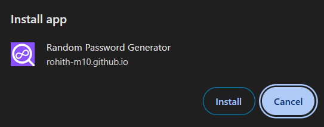
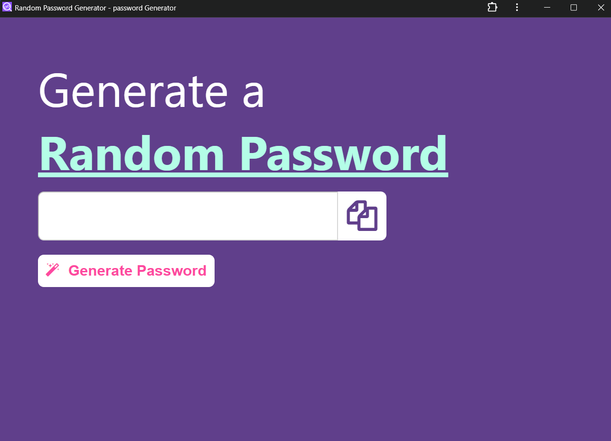

# Random Password Generator PWA

This project is a **Progressive Web App (PWA)** version of a **Random Password Generator**. This guide will explain how to set up and deploy your PWA effectively.

---
## What is a PWA?
A **Progressive Web App (PWA)** is a type of web application that leverages modern web capabilities to deliver an app-like experience. PWAs are reliable, fast, and engaging. They work offline, can be installed on the home screen, and offer improved performance.

---
## Steps to Convert Your Web App into a PWA

### 1. Add a `manifest.json` File
The **Web App Manifest** is a JSON file that provides metadata about your web application. It controls how your app appears to the user and how it's launched.

**`manifest.json`**
```json
{
    "name": "Random Password Generator",
    "short_name": "RPG",
    "start_url": "./index.html",
    "description": "A simple random password generator",
    "display": "standalone",
    "orientation": "portrait-primary",
    "background_color": "#ffffff",
    "theme_color": "#000000",
    "icons": [
        {
            "src": "./favicon.png",
            "sizes": "512x512",
            "type": "image/png",
            "purpose": "any"
        }
    ]
}
```

✅ Add this manifest file to your root directory.

### 2. Add a Service Worker (`sw.js`)
The **Service Worker** is a JavaScript file that acts as a proxy between your app and the network. It enables offline functionality by caching important files.

**`sw.js`**
```javascript
const CACHE_NAME = 'random-password-generator-v1';

self.addEventListener('install', event => {
    event.waitUntil(
        caches.open(CACHE_NAME).then(cache => {
            return cache.addAll([
                './',
                './index.html',
                './style.css',
                './manifest.json',
                './favicon.png',
                './script.js'
            ]);
        })
    );
});

self.addEventListener('activate', event => {
    event.waitUntil(
        caches.keys().then(cacheNames => {
            return Promise.all(
                cacheNames.map(cache => {
                    if (cache !== CACHE_NAME) {
                        console.log('Deleting old cache:', cache);
                        return caches.delete(cache);
                    }
                })
            );
        })
    );
});

self.addEventListener('fetch', event => {
    event.respondWith(
        caches.match(event.request).then(response => {
            return response || fetch(event.request);
        }).catch(() => {
            return caches.match('./index.html');
        })
    );
});
```

✅ Add this file to your root directory.

### 3. Register the Service Worker
In your `script.js`, register the service worker to activate it.

**`script.js`**
```javascript
if ('serviceWorker' in navigator) {
    window.addEventListener('load', () => {
        navigator.serviceWorker.register('./sw.js')
            .then(registration => {
                console.log('Service Worker registered with scope:', registration.scope);
            })
            .catch(error => {
                console.log('Service Worker registration failed:', error);
            });
    });
}
```

### 4. Link Manifest and Service Worker in `index.html`
Add the following lines to the `<head>` section of your `index.html`.

**`index.html` (Relevant Part)**
```html
<head>
    <link rel="manifest" href="./manifest.json" />
    <script src="script.js"></script>
</head>
```

### 5. Add Icons for PWA Compatibility
Include an icon with the recommended size of **512x512** in `.png` format. Add it in your manifest file like this:
```json
"icons": [
    {
        "src": "./favicon.png",
        "sizes": "512x512",
        "type": "image/png",
        "purpose": "any"
    }
]
```

### 6. Test Your PWA
- Open **Chrome DevTools**
- Go to the **Application** tab
- Under **Manifest**, check if your web app details appear correctly
- Under **Service Workers**, check if your service worker is **activated** and **controlling the page**
- Test offline functionality by disabling your internet connection — the site should still load correctly.

### 7. Deploy Your PWA
You can deploy your PWA using:
- **GitHub Pages**
- **Netlify**
- **Vercel**
- **Firebase Hosting**

Ensure that your `start_url` and file paths are correctly set to match your hosting structure.

---
## Key Features
✅ Fully functional offline support  
✅ Installable as a web app on desktop and mobile  
✅ Fast loading due to caching  

---
## Troubleshooting
- **Cache Issues:** Clear your browser cache if updates aren't reflected immediately.
- **Service Worker Not Registering:** Ensure your `sw.js` path is correct and located in the root directory.
- **Manifest Errors:** Verify your `manifest.json` is properly linked in your `index.html`.

---
## Future Improvements
- Implement push notifications for alerts.
- Add background sync to handle network failures effectively.

---
## License
This project is open-source and available for public use.


## Click on the install icon

## Click on install

## Downloaded PWA

